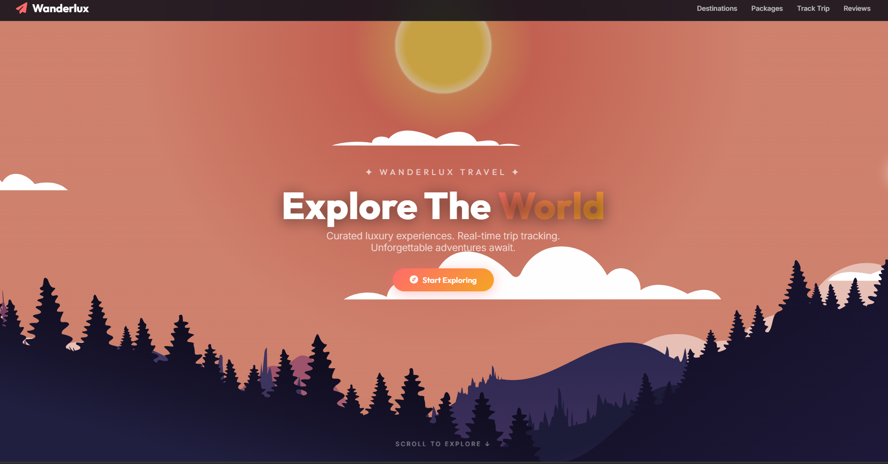
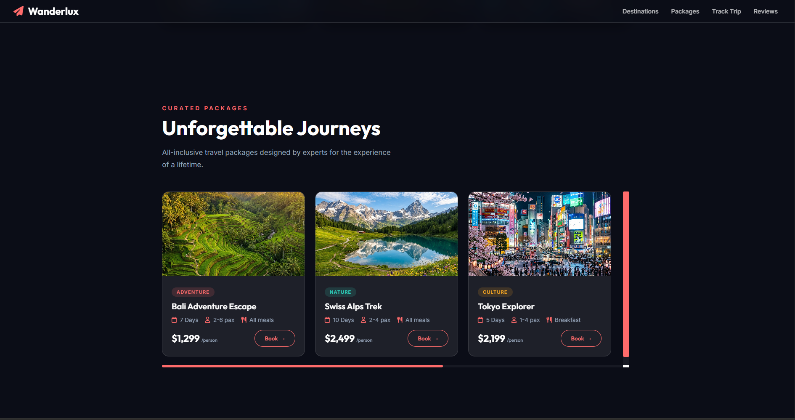
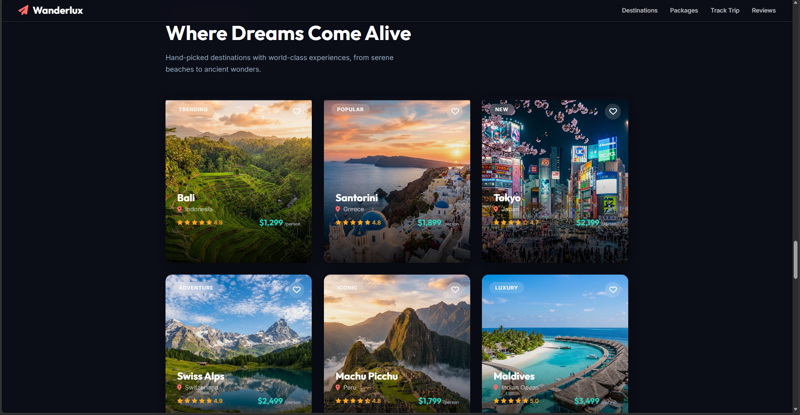
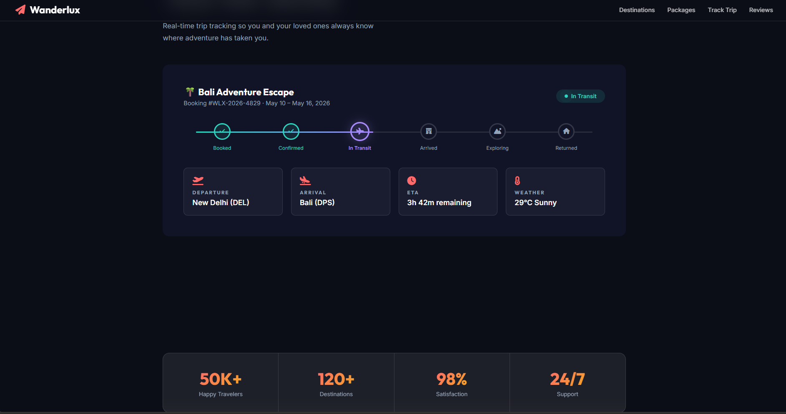
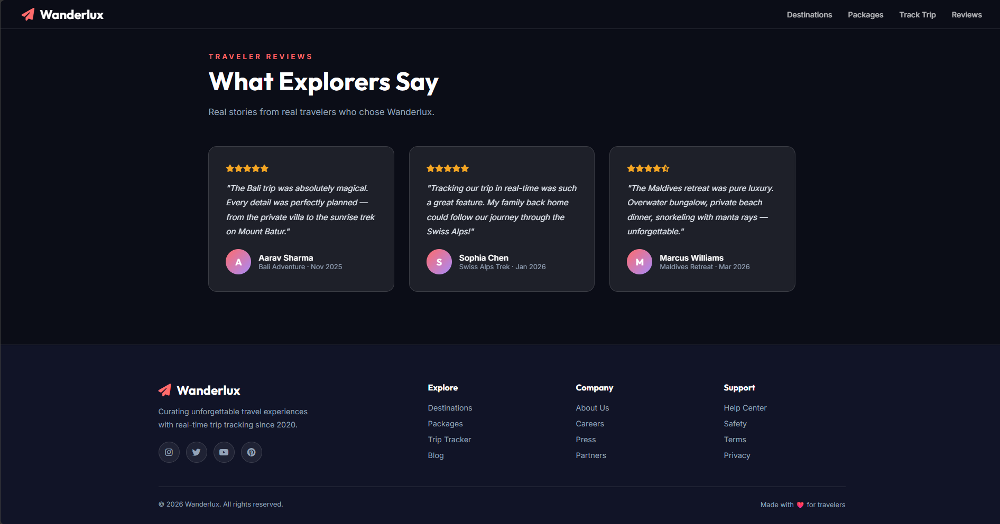

# Wanderlux – Parallax Travel Website

MIT License

A visually immersive **parallax travel website** built with vanilla HTML, CSS, JavaScript, and **GSAP + ScrollTrigger**. The site showcases smooth scroll‑driven animations, glass‑morphism UI, 3D hover effects and a sleek dark theme.

---

## 🌟 Demo



> *The hero parallax scene with animated clouds and gradient sky.*


> *The parallax destinations section with animated destination cards.*


> *The parallax packages section with animated destination cards.*



> *The real-time trip tracker UI with live progress indicators.*


> *The traveler reviews section displaying testimonials.*


---

## ✨ Features

- **Parallax scrolling** with SVG graphics and gradient backgrounds
- **GSAP animations** for scroll‑triggered transitions, hover effects, and micro‑animations
- Interactive **search bar**, destination cards, and curated travel packages
- Real‑time **trip tracker** UI
- Responsive design with glass‑morphism and neon‑style accents
- Fully **open‑source** – MIT licensed

---

## 🛠️ Tech Stack

- **HTML5**, **CSS3** (vanilla, no frameworks)
- **JavaScript** (ES6+)
- **GSAP 3** – core animation library
- **ScrollTrigger** – scroll‑based triggers
- **Font Awesome** icons

---

## 📁 Project Structure

```
📦 parallax-travel-website
 ┣ 📂 dist
 ┃ ┣ 📂 images       # Image assets for destinations and packages
 ┃ ┣ 📜 index.html   # Main HTML file containing the markup
 ┃ ┣ 📜 style.css    # Stylesheet for layout and design
 ┃ ┗ 📜 script.js    # JavaScript for GSAP animations and interactivity
 ┗ 📜 LICENSE        # MIT License
```

---

## 🚀 Getting Started

1. Clone the repository:
   ```bash
   git clone https://github.com/ManasBisht81/Parallax-travel-website.git
   ```
2. Open `index.html` directly in your web browser. Alternatively, you can use an extension like Live Server in VS Code to run it on a local development server with hot reloading.

> The site works without a build step – all assets are static.

---

## 📖 Usage

- **Search** – type a destination, pick dates and travelers, then click *Search*.
- **Explore Destinations** – hover a card for a 3‑D pop‑out effect, click *Book Now*.
- **Packages** – view curated travel packages and book them.
- **Trip Tracker** – see live progress of a booked journey.

---

## 📄 License

This project is licensed under the **MIT License** – see the LICENSE file for details.
